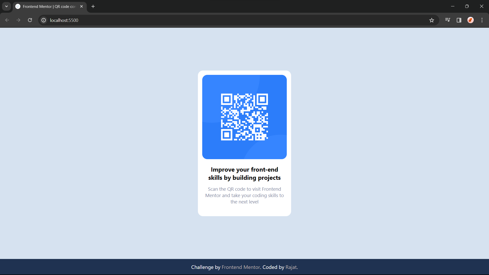

# Frontend Mentor - QR code component solution

This is a solution to the [QR code component challenge on Frontend Mentor](https://www.frontendmentor.io/challenges/qr-code-component-iux_sIO_H). Frontend Mentor challenges help you improve your coding skills by building realistic projects. 

## Table of contents

- [Overview](#overview)
  - [Screenshot](#screenshot)
  - [Links](#links)
- [My process](#my-process)
  - [Built with](#built-with)
  - [What I learned](#what-i-learned)
  - [Continued development](#continued-development)
  - [Useful resources](#useful-resources)

## Overview

### Screenshot

### Links

- Solution URL: [Add solution URL here](https://your-solution-url.com)
- Live Site URL: [Add live site URL here](https://your-live-site-url.com)

## My process

### Built with

- Semantic HTML5 markup
- CSS custom properties
- Flexbox

### What I learned

Through this project, I acquired knowledge and skills in several key areas, encapsulated in following points:

1. HTML: Crafting the project foundation by using the power of HTML and strategically employing `
` elements for effective structuring.

2. CSS: Explore fundamental CSS styling techniques such as `text-align`, `color`, `font-weight`, and elevate my layout skills by mastering the powerful **Flexbox** for precise and effortless container centering.

### Continued development

Flexbox played a crucial role in styling this project from start to finish. I plan to continue using it for future projects as I aim to gain a better understanding of its capabilities

### Useful resources

- [Flexbox Guide](https://css-tricks.com/snippets/css/a-guide-to-flexbox/) - This helped me for revising Flexbox. I really liked this website as it helped me increase the understanding on Flexbox.